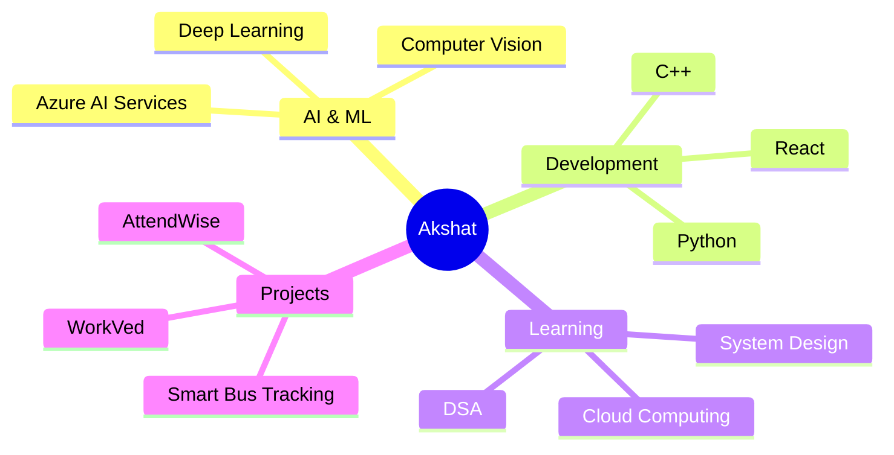

<div align="center">
  
# 👋 Hi, I'm Akshat Dwivedi

### 🤖 B.Tech Student | AI & Machine Learning Enthusiast | Problem Solver


[](https://linkedin.com/in/akshat-dwivedi-918000325)
[](https://www.leetcode.com/akshat123)
[](mailto:akshatdwivedi49@gmail.com)

</div>

---

## 💫 About Me

```python
class AkshatDwivedi:
    def __init__(self):
        self.education = "B.Tech in CSE (AIML)"
        self.specialization = ["AI", "Machine Learning", "Computer Vision"]
        self.current_focus = ["Azure AI Services", "Deep Learning", "DSA"]
        self.interests = ["Smart Systems", "AI-powered Tools", "Innovation"]
        
    def current_projects(self):
        return {
            "🚌 Smart Bus Tracking": "Real-time tracking with AI alerts",
            "📊 AttendWise": "Streamlined attendance management",
            "💼 WorkVed": "LinkedIn for unorganized labor sector"
        }
    
    def say_hi(self):
        print("Thanks for dropping by! Let's build something amazing together! 🚀")

me = AkshatDwivedi()
me.say_hi()
```

---

## 🛠️ Tech Stack

### 🧠 AI & Machine Learning
<p align="left">
  <a href="https://www.python.org" target="_blank"></a>
  <a href="https://www.tensorflow.org" target="_blank"></a>
  <a href="https://pytorch.org/" target="_blank"></a>
  <a href="https://pandas.pydata.org/" target="_blank"></a>
  <a href="https://numpy.org/" target="_blank"></a>
  <a href="https://scikit-learn.org/" target="_blank"></a>
  <a href="https://azure.microsoft.com/en-us/products/ai-services" target="_blank"></a>
</p>

### 💻 Programming & Development
<p align="left">
  <a href="https://en.wikipedia.org/wiki/C_(programming_language)" target="_blank"></a>
  <a href="https://cplusplus.com/" target="_blank"></a>
  <a href="https://reactjs.org/" target="_blank"></a>
  <a href="https://nodejs.org" target="_blank"></a>
  <a href="https://www.w3.org/html/" target="_blank"></a>
  <a href="https://www.w3schools.com/css/" target="_blank"></a>
  <a href="https://developer.mozilla.org/en-US/docs/Web/JavaScript" target="_blank"></a>
</p>

### 🔧 Tools & Platforms
<p align="left">
  <a href="https://git-scm.com/" target="_blank"></a>
  <a href="https://github.com/" target="_blank"></a>
  <a href="https://www.docker.com/" target="_blank"></a>
  <a href="https://code.visualstudio.com/" target="_blank"></a>
  <a href="https://jupyter.org/" target="_blank"></a>
</p>

---

## 🌟 Featured Projects

<div align="center">

| � Project | 📝 Description | 💻 Tech Stack | 🔗 Link |
|:-----------|:---------------|:--------------|:--------|
| **🚌 Smart Bus Tracking** | Real-time college bus tracking system with AI-powered alerts and notifications | Python, GPS, AI | [View →](https://github.com/Akshat5698/Smart-bus-tracking) |
| **📊 AttendWise** | Streamlined attendance management system with automated tracking and reporting | Python, C++ | [View →](https://github.com/Akshat5698/AttendWise) |
| **💼 WorkVed** | LinkedIn-style professional networking platform for the unorganized labor sector | Web Technologies | [View →](https://github.com/Akshat5698/Projects) |

</div>

---

## 📊 GitHub Stats

<div align="center">
  


</div>

<div align="center">
  


</div>

<div align="center">
  


</div>

---

## 🏆 GitHub Trophies

<div align="center">
  


</div>

---

## � Coding Activity

<div align="center">

<!--START_SECTION:waka-->
<!--END_SECTION:waka-->


</div>

---

## 🎯 Current Focus



---

## 💡 What I'm Up To

- 🔭 Currently working on **Smart Bus Tracking System** with AI-powered alerts
- 🌱 Learning **Advanced Deep Learning** and **Azure AI Services**
- 👯 Looking to collaborate on **AI/ML projects** and **innovative solutions**
- 💬 Ask me about **Python, AI, Machine Learning, Computer Vision**
- ⚡ Fun fact: I love turning complex problems into elegant solutions!

---

## 🐍 Contribution Snake

<div align="center">
  


</div>

---

## � Let's Connect!

<div align="center">

I'm always excited to connect with fellow developers, AI enthusiasts, and innovators!

[](https://linkedin.com/in/akshat-dwivedi-918000325)
[](https://www.leetcode.com/akshat123)
[](mailto:akshatdwivedi49@gmail.com)

### 💭 Quote of the Day


</div>


<div align="center">
  
### 🌟 Show some ❤️ by starring some of my repositories!


**✨ "Building the future, one line of code at a time" ✨**

</div>
